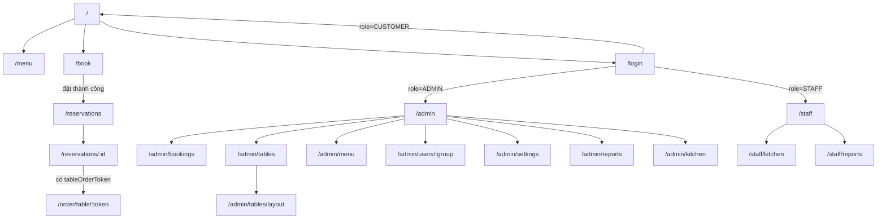
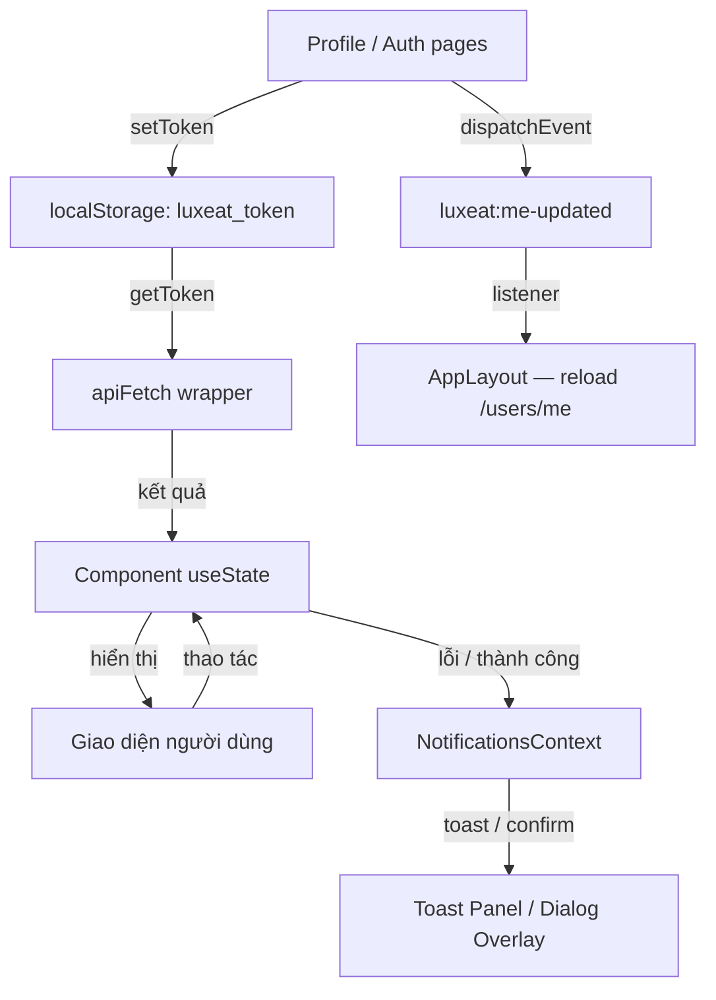

# Tài liệu Kỹ thuật Frontend — PM Restaurant Management

---

## Mục lục

1. [Tổng quan dự án](#1-tổng-quan-dự-án)
2. [Trang & Điều hướng](#2-trang--điều-hướng)
3. [Components](#3-components)
4. [Tích hợp API](#4-tích-hợp-api)
   - 4.1 [Auth, User, Settings](#auth)
   - 4.2 [Menu, Reservations, Tables, Table Session](#menu-public)
   - 4.3 [Admin — Reservations, Menu, Ingredients, Users, Kitchen, Reports, Notifications, Settings](#admin--reservations)
5. [Quản lý State](#5-quản-lý-state)
6. [Biến môi trường](#6-biến-môi-trường)

---

# 1. Tổng quan dự án

## Mô tả dự án

**PM Restaurant Management** là ứng dụng SPA (Single Page Application) quản lý nhà hàng toàn diện, được xây dựng bằng React 19. Hệ thống phục vụ ba nhóm người dùng chính:

- **Khách hàng (Customer)**: Xem thực đơn, đặt bàn, xem lịch sử đặt chỗ, gọi món tại bàn qua mã QR.
- **Nhân viên (Staff)**: Quản lý đặt bàn tại quầy lễ tân, theo dõi và xử lý đơn hàng bếp.
- **Quản trị viên (Admin)**: Quản lý toàn bộ hệ thống — thực đơn, bàn, người dùng, cài đặt, báo cáo doanh thu.

## Tech Stack

| Hạng mục | Công nghệ | Phiên bản |
|----------|-----------|-----------|
| Framework | React | ^19.2.4 |
| Ngôn ngữ | TypeScript | ^5.9.3 |
| Build Tool | Vite | ^8.0.1 |
| Routing | React Router DOM | ^7.9.2 |
| Styling | CSS thuần (BEM naming) | — |
| State Management | React Context API + useState | — |
| HTTP Client | Fetch API (wrapper tự xây dựng) | — |
| Icons | lucide-react | ^1.7.0 |
| Biểu đồ | recharts | ^2.x |
| Excel Export | exceljs + file-saver | ^4.x / ^2.x |
| Linting | ESLint | — |

## Yêu cầu cài đặt

- **Node.js** >= 18.x
- **npm** >= 9.x (hoặc pnpm / yarn)
- Backend server chạy tại `http://localhost:5000`

## Các bước chạy dự án

```bash
# 1. Clone repository
git clone <repo-url>
cd PM-restaurant-management/frontend

# 2. Cài đặt dependencies
npm install

# 3. Tạo file .env từ mẫu
cp .env.example .env
# Chỉnh sửa VITE_API_BASE_URL nếu backend không chạy ở localhost:5000

# 4. Khởi động môi trường phát triển
npm run dev

# 5. Mở trình duyệt tại http://localhost:5173
```

## NPM Scripts

| Script | Lệnh | Mô tả |
|--------|------|-------|
| `dev` | `vite` | Khởi động dev server với HMR tại port 5173 |
| `build` | `tsc -b && vite build` | Kiểm tra TypeScript rồi build production |
| `preview` | `vite preview` | Xem trước bản build production tại localhost |
| `lint` | `eslint .` | Kiểm tra lỗi code style với ESLint |

## Cấu hình Vite (vite.config.ts)

Vite được cấu hình với **proxy** để tránh lỗi CORS khi phát triển:

- `/api/*` → `http://localhost:5000` — Toàn bộ REST API calls
- `/uploads/*` → `http://localhost:5000` — Truy cập file ảnh đã upload

## Cấu trúc thư mục

```
frontend/
├── docs/                      # Tài liệu kỹ thuật (thư mục này)
├── public/                    # Static assets (favicon, robots.txt...)
├── src/
│   ├── main.tsx               # Entry point — mount React app, bọc providers
│   ├── App.tsx                # Cấu hình routing toàn cục
│   ├── index.css              # CSS global (reset, biến màu, typography)
│   │
│   ├── context/               # React Context providers
│   │   └── NotificationsContext.tsx   # Toast + Confirm dialog toàn cục
│   │
│   ├── layouts/               # Layout wrapper cho từng nhóm route
│   │   ├── AppLayout/         # Layout customer-facing (header, footer)
│   │   ├── AdminLayout/       # Layout admin (sidebar điều hướng)
│   │   └── StaffLayout/       # Layout nhân viên (top navigation)
│   │
│   ├── pages/                 # Các trang tương ứng với route
│   │   ├── Home/              # Trang chủ (/)
│   │   ├── Auth/              # Đăng nhập, đăng ký, quên/đặt lại mật khẩu
│   │   ├── Menu/              # Xem thực đơn
│   │   ├── Booking/           # Đặt bàn và lịch sử đặt chỗ
│   │   ├── TableOrder/        # Gọi món tại bàn qua QR
│   │   ├── Profile/           # Hồ sơ người dùng
│   │   ├── Admin/             # Toàn bộ trang quản trị
│   │   │   ├── Dashboard.jsx
│   │   │   ├── BookingManagement.jsx
│   │   │   ├── TableManagement.jsx
│   │   │   ├── TableLayoutEditor.jsx
│   │   │   ├── MenuManagement.jsx
│   │   │   ├── IngredientManagement.jsx  # Quản lý nguyên liệu & đơn vị tính
│   │   │   ├── UserManagement.jsx
│   │   │   ├── Settings.jsx
│   │   │   └── RevenueReports.tsx
│   │   └── Staff/             # Giao diện nhân viên
│   │       ├── StaffDesk.jsx  # Alias BookingManagement với prop staffMode
│   │       └── KitchenOrders.jsx
│   │
│   ├── components/            # Shared UI components tái sử dụng
│   │   ├── NotificationBell   # Chuông thông báo realtime
│   │   ├── PasswordField      # Input mật khẩu với toggle hiển thị
│   │   └── AdminPagination    # Phân trang cho bảng admin
│   │
│   └── lib/                   # Utilities, API client, helpers
│       ├── api.ts             # HTTP client wrapper (apiFetch, publicApiFetch)
│       ├── format.ts          # formatCurrency, formatPercent
│       ├── validation.ts      # Validators (email, phone VN)
│       ├── reservation.ts     # Normalize dữ liệu đặt bàn từ API
│       └── settings.ts        # Fetch cài đặt nhà hàng công khai
│
├── package.json
├── vite.config.ts
├── tsconfig.json
└── tsconfig.app.json
```

---

# 2. Trang & Điều hướng

## Bảng routing tổng quan

| Path | Component | Mô tả | Yêu cầu Auth | Layout |
|------|-----------|-------|:------------:|--------|
| `/` | `Home` | Trang chủ, giới thiệu nhà hàng | Không | `AppLayout` |
| `/menu` | `Menu` | Xem thực đơn | Không | `AppLayout` |
| `/book` | `BookTable` | Form đặt bàn | Không | `AppLayout` |
| `/reservations` | `ReservationHistory` | Lịch sử đặt chỗ | **Có** | `AppLayout` |
| `/reservations/:id` | `ReservationsIdRedirect` | Deep link redirect đến chi tiết đặt bàn | **Có** | `AppLayout` |
| `/order/table/:token` | `TableOrder` | Gọi món tại bàn qua QR | Không | — (standalone) |
| `/profile` | `Profile` | Hồ sơ người dùng | **Có** | `AppLayout` |
| `/login` | `Login` | Đăng nhập | Không | `AppLayout` |
| `/register` | `Register` | Đăng ký tài khoản | Không | `AppLayout` |
| `/forgot-password` | `ForgotPassword` | Yêu cầu đặt lại mật khẩu | Không | `AppLayout` |
| `/reset-password` | `ResetPassword` | Đặt lại mật khẩu (token query param) | Không | `AppLayout` |
| `/admin` | `Dashboard` | Tổng quan quản trị | **ADMIN** | `AdminLayout` |
| `/admin/bookings` | `BookingManagement` | Quản lý đặt bàn | **ADMIN** | `AdminLayout` |
| `/admin/tables` | `TableManagement` | Quản lý bàn & khu vực | **ADMIN** | `AdminLayout` |
| `/admin/tables/layout` | `TableLayoutEditor` | Chỉnh sơ đồ bàn kéo-thả | **ADMIN** | `AdminLayout` |
| `/admin/menu` | `MenuManagement` | Quản lý thực đơn | **ADMIN** | `AdminLayout` |
| `/admin/ingredients` | `IngredientManagement` | Quản lý nguyên liệu & đơn vị tính | **ADMIN** | `AdminLayout` |
| `/admin/users` | `Navigate` | Redirect đến `/admin/users/customers` | **ADMIN** | `AdminLayout` |
| `/admin/users/:group` | `UserManagement` | Quản lý người dùng theo nhóm | **ADMIN** | `AdminLayout` |
| `/admin/settings` | `Settings` | Cài đặt nhà hàng | **ADMIN** | `AdminLayout` |
| `/admin/reports` | `RevenueReports` | Báo cáo doanh thu | **ADMIN** | `AdminLayout` |
| `/admin/kitchen` | `KitchenOrders` | Xử lý đơn bếp (admin view) | **ADMIN** | `AdminLayout` |
| `/staff` | `StaffDesk` | Quầy lễ tân nhân viên | **STAFF** | `StaffLayout` |
| `/staff/kitchen` | `KitchenOrders` | Xử lý đơn bếp (staff view) | **STAFF** | `StaffLayout` |
| `/staff/reports` | `RevenueReports` | Xem báo cáo (staff view) | **STAFF** | `StaffLayout` |
| `*` | `Navigate to /` | Wildcard — redirect về trang chủ | — | — |

## Sơ đồ điều hướng



## Chi tiết từng trang

### `/` — Home

**Mục đích**: Trang chủ giới thiệu nhà hàng cho khách hàng.

**Thao tác người dùng**:
- Xem thông tin, ảnh banner, giờ mở cửa
- Click "Đặt bàn ngay" → `/book`
- Click "Xem thực đơn" → `/menu`

**Component chính**: `Home`  
**API endpoints**: `GET /settings/public`  
**Điều hướng đến**: `/book`, `/menu`

---

### `/menu` — Menu

**Mục đích**: Hiển thị toàn bộ thực đơn với bộ lọc theo danh mục và tình trạng.

**Thao tác người dùng**:
- Lọc theo danh mục món ăn
- Lọc theo tình trạng (còn hàng / hết hàng)
- Tìm kiếm theo tên món
- Xem pill "Bàn của bạn" nếu đang có phiên gọi món

**API endpoints**: `GET /menu`, `GET /menu/categories`, `GET /table-session/me`  
**Điều hướng từ**: `/`, header navigation

---

### `/book` — BookTable

**Mục đích**: Form đặt bàn — chọn ngày, giờ, số người, bàn và gọi món trước.

**Thao tác người dùng**:
- Chọn ngày, giờ, số khách
- Lọc bàn theo khu vực
- Chọn bàn phù hợp (kiểm tra sức chứa)
- Thêm món vào đơn đặt trước (tùy chọn)
- Submit form đặt bàn

**Validation**: Số điện thoại VN, sức chứa bàn ≥ số khách & ≤ số khách × 2  
**API endpoints**: `GET /tables`, `GET /menu`, `GET /zones`, `POST /reservations`  
**Điều hướng đến**: `/reservations` (sau khi đặt thành công)

---

### `/reservations` — ReservationHistory

**Mục đích**: Xem danh sách tất cả đặt bàn của người dùng hiện tại.

**Thao tác người dùng**:
- Xem danh sách với trạng thái màu sắc
- Click vào đặt bàn để xem chi tiết (modal)
- Hủy đặt bàn ở trạng thái PENDING/HOLD
- Deep link qua query param `?detail=<id>`

**API endpoints**: `GET /reservations`, `GET /reservations/:id`, `POST /reservations/:id/cancel`

---

### `/order/table/:token` — TableOrder

**Mục đích**: Giao diện gọi món tại bàn dành cho khách — truy cập qua mã QR, không cần đăng nhập.

**Thao tác người dùng**:
- Xem thực đơn, lọc theo danh mục, tìm kiếm
- Thêm/bớt món vào giỏ hàng
- Mở giỏ hàng và xem tổng tiền
- Chọn phương thức thanh toán (tiền mặt / chuyển khoản)
- Xem QR chuyển khoản ngân hàng
- Theo dõi trạng thái đơn hàng

**API endpoints**: `GET /table-session/:token`, `POST /table-session/:token/items`, `PATCH /table-session/:token/items/:itemId`, `GET /table-session/:token/payment`

---

### `/admin` — Dashboard

**Mục đích**: Màn hình tổng quan admin với số liệu chính và danh sách đặt bàn gần đây.

**Thao tác người dùng**:
- Xem doanh thu hôm nay, số bàn đang dùng, số đặt chỗ, số người dùng
- Xem và tìm kiếm danh sách đặt bàn
- Xác nhận / hủy đặt bàn nhanh

**API endpoints**: `GET /admin/reports/revenue`, `GET /admin/reservations`, `GET /tables`, `GET /admin/users`, `POST /admin/reservations/:id/confirm`, `POST /admin/reservations/:id/cancel`

---

### `/admin/bookings` — BookingManagement

**Mục đích**: Quản lý toàn bộ đặt bàn theo ngày. Dùng kép cho cả Admin (`/admin/bookings`) và Staff (`/staff`) qua prop `staffMode`.

**Thao tác người dùng**:
- Điều hướng theo ngày (pager từng ngày)
- Lọc theo trạng thái (tất cả / chờ xác nhận / đã xác nhận / hoàn thành)
- Tìm kiếm theo tên, SĐT, ID đơn
- Gán bàn cho đặt bàn
- Xác nhận đặt bàn → trả về QR gọi món nếu có phiên
- Check-in khách → mở phiên gọi món, hiện modal QR
- Chuyển bàn (transfer-table) với lý do
- Trả bàn / gỡ khách (release-guest) — kết thúc phiên QR, bàn trở lại trống
- Hủy đơn
- **Mở bàn vãng lai** (walk-in): mở bàn tức thì cho khách không đặt trước
- Xem QR gọi món của đơn đang check-in
- Xem QR thanh toán chuyển khoản (tích hợp SePay)

**API endpoints**: `GET /admin/reservations`, `GET /tables`, `GET /admin/settings`, `POST /admin/reservations/:id/confirm`, `POST /admin/reservations/:id/check-in`, `POST /admin/reservations/:id/cancel`, `POST /admin/reservations/:id/assign-table`, `POST /admin/reservations/:id/transfer-table`, `POST /admin/reservations/:id/release-guest`, `GET /admin/reservations/:id/order-qr`, `GET /admin/reservations/:id/order-total`, `POST /admin/reservations/walk-in`

---

### `/admin/menu` — MenuManagement

**Mục đích**: Quản lý toàn bộ món ăn và danh mục trong thực đơn.

**Thao tác người dùng**:
- Lọc theo danh mục (chip), lọc theo tình trạng (còn / hết món), tìm kiếm
- Thêm / sửa / xóa món ăn
- Upload ảnh món ăn hoặc nhập URL ảnh
- Bật/tắt tình trạng có sẵn bằng toggle switch
- Thêm / xóa danh mục
- **Liên kết nguyên liệu**: mỗi món ăn có thể gán danh sách nguyên liệu kèm số lượng cần dùng (lấy từ `IngredientManagement`)
- Phân trang

**API endpoints**: `GET /admin/menu-items`, `POST /admin/menu-items`, `PATCH /admin/menu-items/:id`, `DELETE /admin/menu-items/:id`, `POST /admin/menu-items/:id/image`, `POST /admin/menu-items/:id/toggle-active`, `GET /admin/categories`, `POST /admin/categories`, `DELETE /admin/categories/:id`, `GET /admin/ingredients`

---

### `/admin/ingredients` — IngredientManagement

**Mục đích**: Quản lý nguyên liệu kho và đơn vị tính. Gồm hai tab chính.

**Tab Danh sách Nguyên liệu**:
- Xem danh sách nguyên liệu với tên, đơn vị tính, tồn kho, ngưỡng cảnh báo, trạng thái
- Tìm kiếm theo tên
- **Thêm** nguyên liệu mới (tên, đơn vị tính, số lượng tồn ban đầu, ngưỡng cảnh báo tối thiểu)
- **Sửa** nguyên liệu
- **Nhập kho**: thêm số lượng vào tồn kho kèm ghi chú
- **Lịch sử nhập kho**: xem toàn bộ lịch sử nhập với ngày, số lượng, ghi chú
- **Xóa** nguyên liệu

**Tab Đơn vị tính**:
- Xem danh sách đơn vị tính (kg, lít, hộp...)
- Thêm đơn vị tính mới
- Xóa đơn vị tính

**Validation**: tên không được trống, số lượng và ngưỡng cảnh báo không được âm, số lượng nhập kho phải > 0

**API endpoints**: `GET /admin/ingredients`, `POST /admin/ingredients`, `PATCH /admin/ingredients/:id`, `DELETE /admin/ingredients/:id`, `POST /admin/ingredients/:id/import`, `GET /admin/ingredients/:id/imports`, `GET /admin/ingredients/units`, `POST /admin/ingredients/units`, `DELETE /admin/ingredients/units/:id`

---

### `/admin/reports` và `/staff/reports` — RevenueReports

**Mục đích**: Xem và xuất báo cáo doanh thu theo hai chế độ.

**Tab Theo kỳ thời gian**:
- Chọn nhóm theo Ngày / Tháng / Năm
- Lọc theo khoảng ngày (từ — đến), bộ lọc nhanh: Hôm nay, 7 ngày, 30 ngày
- 4 KPI cards: Tổng doanh thu, Số hóa đơn, Giá trị trung bình, Tăng trưởng so kỳ trước
- Biểu đồ cột (Recharts `BarChart`) trực quan hóa doanh thu theo kỳ
- Bảng chi tiết phân trang, click vào một kỳ để xem chi tiết hóa đơn trong modal

**Tab Theo bàn**:
- Xem tổng doanh thu phân theo từng bàn
- Expand từng bàn để xem danh sách hóa đơn + chi tiết món

**Xuất Excel** (ExcelJS + file-saver): 4 sheet — Tổng quan, Doanh thu theo kỳ, Hóa đơn, Chi tiết món

**API endpoints**: `GET /admin/reports/revenue`, `GET /admin/reports/revenue/by-table`, `GET /admin/reports/revenue/invoices`

---

### `/admin/users/:group` — UserManagement

**`:group`** nhận giá trị: `customers`, `staff`, `admins`

**Thao tác người dùng**:
- Tìm kiếm, lọc trạng thái, lọc theo ngày tạo
- Tạo / sửa / xóa người dùng
- Upload avatar
- Phân trang

---

### `/staff` — StaffDesk

**Mục đích**: Giao diện tiếp đón của nhân viên — thực chất là component `BookingManagement` được render với prop `staffMode={true}`.

**Điểm khác biệt so với admin view**: tiêu đề hiển thị "Tiếp đón & quản lý bàn" thay vì "Đặt bàn". Toàn bộ chức năng quản lý đặt bàn, gán bàn, check-in, mở bàn vãng lai đều giống admin.

**Vị trí**: [src/pages/Staff/StaffDesk.jsx](src/pages/Staff/StaffDesk.jsx) — chỉ 5 dòng, re-export `BookingManagement` với prop `staffMode`.

---

# 3. Components

## Layout Components

---

### AppLayout

**Vị trí**: [src/layouts/AppLayout/AppLayout.tsx](src/layouts/AppLayout/AppLayout.tsx)  
**Mô tả**: Layout bao ngoài toàn bộ trang customer-facing. Hiển thị header với điều hướng, logo nhà hàng và footer thông tin liên hệ.

**State nội bộ**:
- `me`: Thông tin user đang đăng nhập (`id, email, role, fullName, avatarUrl`)
- `brand`: Tên và logo nhà hàng
- `publicInfo`: Địa chỉ, SĐT, email, giờ mở cửa, social links
- `menuOpen`: Toggle menu mobile

**Side effects**:
- Fetch `GET /users/me` khi mount và khi nhận sự kiện `luxeat:me-updated`
- Fetch `fetchPublicSettings()` khi mount và khi tab được focus lại

**Điều hướng header**:
- Khách chưa đăng nhập: Đăng nhập, Đăng ký
- Khách đăng nhập: Thực đơn, Đặt bàn, Đặt chỗ của tôi, Trang cá nhân, Đăng xuất
- Admin: thêm link "Quản trị"
- Staff: thêm link "Giao diện nhân viên"

---

### AdminLayout

**Vị trí**: [src/layouts/AdminLayout/AdminLayout.jsx](src/layouts/AdminLayout/AdminLayout.jsx)  
**Mô tả**: Layout cho toàn bộ trang admin. Bao gồm sidebar điều hướng dạng nhóm thu gọn và top bar với thông tin user.

**Kiểm tra quyền**: Redirect STAFF → `/staff`, CUSTOMER → `/`, chỉ ADMIN được vào.

**Sidebar navigation**:
- Tổng quan → `/admin`
- **Vận hành**: Đặt bàn (`/admin/bookings`), Quản lý bàn (`/admin/tables`), Bếp & Gọi món (`/admin/kitchen`), Doanh thu (`/admin/reports`)
- **Thực đơn**: Món ăn (`/admin/menu`), Nguyên liệu (`/admin/ingredients`)
- **Hệ thống**: Người dùng (`/admin/users/customers`), Cài đặt (`/admin/settings`)

**Props**: Không có (dùng `<Outlet />` của React Router)

---

### StaffLayout

**Vị trí**: [src/layouts/StaffLayout/StaffLayout.jsx](src/layouts/StaffLayout/StaffLayout.jsx)  
**Mô tả**: Layout cho nhân viên. Top bar đơn giản với hai liên kết chính và chuông thông báo.

**Kiểm tra quyền**: Redirect ADMIN → `/admin`, CUSTOMER → `/`, chỉ STAFF được vào.

**Navigation**: Tiếp đón (`/staff`), Bếp & Gọi món (`/staff/kitchen`)

---

## Feature Components

---

### NotificationBell

**Vị trí**: [src/components/NotificationBell.jsx](src/components/NotificationBell.jsx)  
**Mô tả**: Chuông thông báo realtime hiển thị trên top bar của Admin và Staff layout. Tự động làm mới mỗi 20 giây.

**Props**: Không có

**State nội bộ**:
- `notifications[]`: Danh sách thông báo chưa đọc
- `open`: Dropdown toggle
- `count`: Số thông báo chưa đọc

**API calls**:
- `GET /admin/notifications` — Lấy danh sách
- `PATCH /admin/notifications/{id}/read` — Đánh dấu một thông báo đã đọc
- `POST /admin/notifications/read-all` — Đánh dấu tất cả đã đọc

**Ví dụ sử dụng**:
```tsx
<NotificationBell />
```

---

### PasswordField

**Vị trí**: [src/components/PasswordField.tsx](src/components/PasswordField.tsx)  
**Mô tả**: Input mật khẩu có nút toggle hiển thị/ẩn, hỗ trợ hiển thị lỗi và accessibility.

**Props**:

| Prop | Type | Required | Default | Mô tả |
|------|------|:--------:|---------|-------|
| `label` | `string` | Có | — | Nhãn hiển thị trên field |
| `value` | `string` | Có | — | Giá trị hiện tại |
| `onChange` | `(val: string) => void` | Có | — | Callback khi thay đổi |
| `autoComplete` | `string` | Không | `'current-password'` | Giá trị HTML autocomplete |
| `required` | `boolean` | Không | `false` | Bắt buộc nhập |
| `disabled` | `boolean` | Không | `false` | Vô hiệu hóa input |
| `placeholder` | `string` | Không | — | Placeholder text |
| `className` | `string` | Không | — | CSS class bổ sung |
| `error` | `string \| null` | Không | — | Thông báo lỗi hiển thị dưới field |

**Ví dụ sử dụng**:
```tsx
<PasswordField
  label="Mật khẩu"
  value={password}
  onChange={setPassword}
  error={fieldErr.password}
  required
/>
```

---

### AdminPagination

**Vị trí**: [src/components/AdminPagination.jsx](src/components/AdminPagination.jsx)  
**Mô tả**: Component phân trang dùng trong các bảng quản trị. Hỗ trợ chọn số dòng/trang và hiển thị số trang dạng rút gọn.

**Props**:

| Prop | Type | Required | Default | Mô tả |
|------|------|:--------:|---------|-------|
| `page` | `number` | Có | — | Trang hiện tại (bắt đầu từ 1) |
| `pageSize` | `number` | Có | — | Số dòng mỗi trang |
| `total` | `number` | Có | — | Tổng số dòng dữ liệu |
| `onPageChange` | `(page: number) => void` | Có | — | Callback khi đổi trang |
| `onPageSizeChange` | `(size: number) => void` | Có | — | Callback khi đổi pageSize |
| `pageSizeOptions` | `number[]` | Không | `[10, 20, 50]` | Các tùy chọn số dòng/trang |
| `showPageSize` | `boolean` | Không | `true` | Hiển thị dropdown chọn pageSize |
| `showVisibleRange` | `boolean` | Không | `false` | Hiển thị "đang xem X–Y của Z" |
| `className` | `string` | Không | — | CSS class bổ sung |

**Ví dụ sử dụng**:
```tsx
<AdminPagination
  page={page}
  pageSize={pageSize}
  total={totalRows}
  onPageChange={setPage}
  onPageSizeChange={(s) => { setPageSize(s); setPage(1); }}
/>
```

---

## Shared UI Components

---

### ReservationDetailView

**Vị trí**: [src/pages/Booking/ReservationDetailView.tsx](src/pages/Booking/ReservationDetailView.tsx)  
**Mô tả**: Component dùng kép — hiển thị dưới dạng trang độc lập hoặc modal overlay. Hiển thị chi tiết đặt bàn và cho phép hủy.

**Props**:

| Prop | Type | Required | Default | Mô tả |
|------|------|:--------:|---------|-------|
| `bookingId` | `string` | Có | — | ID đặt bàn cần xem |
| `variant` | `'page' \| 'modal'` | Có | — | Kiểu hiển thị |
| `onClose` | `() => void` | Không | — | Callback khi đóng (dùng cho modal) |
| `onCancelled` | `() => void` | Không | — | Callback sau khi hủy thành công |

**Trạng thái đặt bàn** (status):

| Status | Nhãn hiển thị | Màu |
|--------|---------------|-----|
| `HOLD` | Đang giữ chỗ | Vàng |
| `PENDING` | Chờ xác nhận | Xanh dương |
| `CONFIRMED` | Đã xác nhận | Xanh lá |
| `CHECKED_IN` | Đã check-in | Tím |
| `COMPLETED` | Hoàn thành | Xám |
| `CANCELLED` | Đã hủy | Đỏ |
| `PAID` | Đã thanh toán | Xanh đậm |

**Ví dụ sử dụng**:
```tsx
{/* Dùng như modal */}
<ReservationDetailView
  bookingId={selectedId}
  variant="modal"
  onClose={() => setSelectedId(null)}
  onCancelled={reloadList}
/>
```

---

# 4. Tích hợp API

## Cấu hình HTTP Client

**Vị trí**: [src/lib/api.ts](src/lib/api.ts)

### Base URL

```typescript
const API_BASE = import.meta.env.VITE_API_BASE_URL || 'http://localhost:5000/api'
```

Giá trị mặc định cho phép ứng dụng hoạt động ngay không cần file `.env`.

### Hai hàm fetch chính

```typescript
// Yêu cầu xác thực — tự động gắn Bearer token từ localStorage
apiFetch<T>(path: string, init?: RequestInit): Promise<ApiResponse<T>>

// Endpoint công khai — không gắn token
publicApiFetch<T>(path: string, init?: RequestInit): Promise<ApiResponse<T>>
```

### Cơ chế xác thực

Token JWT được lưu tại `localStorage` với key `luxeat_token`.

```typescript
getToken()        // Đọc token từ localStorage
setToken(token)   // Lưu / xóa token (setToken(null) để đăng xuất)
```

Header được gắn tự động trong `apiFetch`:
```
Authorization: Bearer <token>
Content-Type: application/json
```

### Kiểu dữ liệu trả về

```typescript
type ApiResponse<T> =
  | { success: true; data: T; meta?: { page; pageSize; total } }
  | { success: false; error: { code: string; message: string; details?: unknown } }
```

Hàm fetch luôn ném `Error` nếu `success === false`, cho phép `try/catch` đồng nhất ở mọi nơi.

### Xử lý lỗi

Mọi lỗi API được bắt qua `try/catch` tại component gọi, sau đó hiển thị toast:

```typescript
try {
  const res = await apiFetch<...>('/endpoint', { method: 'POST', body: JSON.stringify(data) })
  // xử lý thành công
} catch (err) {
  toast((err as Error).message, { variant: 'error' })
}
```

Không có interceptor tập trung cho `401` — mỗi layout tự redirect khi không có user hoặc sai role.

### Hàm tiện ích media

```typescript
getApiOrigin()                    // Trả về origin URL (bỏ phần /api)
mediaUrl(path: string)            // Chuyển path tương đối → URL đầy đủ
storagePathFromMediaUrl(url)      // Trích xuất storage path từ URL đầy đủ
```

---

## Danh sách toàn bộ API calls

### Auth

| Endpoint | Method | Function/Hook | Dùng trong | Mô tả |
|----------|--------|---------------|------------|-------|
| `/auth/login` | POST | `apiFetch` | `Login` | Đăng nhập, trả về JWT + user |
| `/auth/register` | POST | `apiFetch` | `Register` | Tạo tài khoản mới |
| `/auth/forgot-password` | POST | `publicApiFetch` | `ForgotPassword` | Gửi email reset |
| `/auth/reset-password` | POST | `publicApiFetch` | `ResetPassword` | Đặt lại mật khẩu bằng token |

### User

| Endpoint | Method | Function/Hook | Dùng trong | Mô tả |
|----------|--------|---------------|------------|-------|
| `/users/me` | GET | `apiFetch` | `AppLayout`, `Profile`, các Layout | Lấy thông tin user đang đăng nhập |
| `/users/me` | PATCH | `apiFetch` | `Profile` | Cập nhật hồ sơ (tên, email, SĐT) |
| `/users/me/avatar` | POST | `apiFetch` (multipart) | `Profile` | Upload ảnh đại diện của bản thân |

### Settings (Public)

| Endpoint | Method | Function/Hook | Dùng trong | Mô tả |
|----------|--------|---------------|------------|-------|
| `/settings/public` | GET | `fetchPublicSettings()` | `Home`, `AppLayout`, `Login`, `BookTable` | Lấy cài đặt công khai nhà hàng |

### Menu (Public)

| Endpoint | Method | Function/Hook | Dùng trong | Mô tả |
|----------|--------|---------------|------------|-------|
| `/menu` | GET | `publicApiFetch` | `Menu`, `BookTable` | Danh sách toàn bộ món ăn |
| `/menu/categories` | GET | `publicApiFetch` | `Menu` | Danh mục món ăn |

### Reservations (Customer)

| Endpoint | Method | Function/Hook | Dùng trong | Mô tả |
|----------|--------|---------------|------------|-------|
| `/reservations` | GET | `apiFetch` | `ReservationHistory` | Đặt bàn của user hiện tại |
| `/reservations` | POST | `apiFetch` | `BookTable` | Tạo đặt bàn mới |
| `/reservations/:id` | GET | `apiFetch` | `ReservationDetailView` | Chi tiết một đặt bàn |
| `/reservations/:id/cancel` | POST | `apiFetch` | `ReservationDetailView` | Hủy đặt bàn |

### Tables & Zones (Public + Admin)

| Endpoint | Method | Function/Hook | Dùng trong | Mô tả |
|----------|--------|---------------|------------|-------|
| `/tables` | GET | `publicApiFetch` | `BookTable`, `Dashboard`, `TableManagement` | Danh sách bàn |
| `/tables` | POST | `apiFetch` | `TableManagement` | Tạo bàn mới |
| `/tables/:id` | PATCH | `apiFetch` | `TableManagement`, `TableLayoutEditor` | Cập nhật thông tin/vị trí bàn |
| `/tables/:id` | DELETE | `apiFetch` | `TableManagement` | Xóa bàn |
| `/tables/:id/image` | POST | `uploadTableImage()` | `TableManagement` | Upload ảnh bàn |
| `/zones` | GET | `publicApiFetch` | `BookTable`, `TableManagement` | Danh sách khu vực |
| `/zones` | POST | `apiFetch` | `TableManagement` | Tạo khu vực mới |
| `/zones/:id` | DELETE | `apiFetch` | `TableManagement` | Xóa khu vực |

### Table Session (QR Order)

| Endpoint | Method | Function/Hook | Dùng trong | Mô tả |
|----------|--------|---------------|------------|-------|
| `/table-session/me` | GET | `apiFetch` | `Menu` | Phiên gọi món hiện tại của user |
| `/table-session/:token` | GET | `publicApiFetch` | `TableOrder` | Thông tin phiên bàn theo token |
| `/table-session/:token/items` | POST | `apiFetch` | `TableOrder` | Thêm món vào đơn |
| `/table-session/:token/items/:id` | PATCH | `apiFetch` | `TableOrder` | Cập nhật số lượng món |
| `/table-session/:token/payment` | GET | `apiFetch` | `TableOrder` | Lấy thông tin thanh toán |

### Admin — Reservations

| Endpoint | Method | Function/Hook | Dùng trong | Mô tả |
|----------|--------|---------------|------------|-------|
| `/admin/reservations` | GET | `apiFetch` | `BookingManagement`, `Dashboard` | Danh sách tất cả đặt bàn |
| `/admin/reservations/walk-in` | POST | `apiFetch` | `BookingManagement` | Mở bàn vãng lai tức thì |
| `/admin/reservations/:id/confirm` | POST | `apiFetch` | `BookingManagement`, `Dashboard` | Xác nhận đặt bàn |
| `/admin/reservations/:id/check-in` | POST | `apiFetch` | `BookingManagement` | Check-in khách, mở phiên gọi món |
| `/admin/reservations/:id/cancel` | POST | `apiFetch` | `BookingManagement`, `Dashboard` | Hủy đặt bàn |
| `/admin/reservations/:id/assign-table` | POST | `apiFetch` | `BookingManagement` | Gán bàn cho đặt bàn |
| `/admin/reservations/:id/transfer-table` | POST | `apiFetch` | `BookingManagement` | Chuyển bàn (có lý do, giữ QR) |
| `/admin/reservations/:id/release-guest` | POST | `apiFetch` | `BookingManagement` | Trả bàn / gỡ khách, đóng phiên QR |
| `/admin/reservations/:id/order-qr` | GET | `apiFetch` | `BookingManagement` | Lấy QR gọi món của đơn đang check-in |
| `/admin/reservations/:id/order-total` | GET | `apiFetch` | `BookingManagement` | Lấy tổng tiền đơn để hiển thị QR thanh toán |

### Admin — Menu

| Endpoint | Method | Function/Hook | Dùng trong | Mô tả |
|----------|--------|---------------|------------|-------|
| `/admin/menu-items` | GET | `apiFetch` | `MenuManagement` | Danh sách món ăn (admin) |
| `/admin/menu-items` | POST | `apiFetch` | `MenuManagement` | Tạo món ăn mới (kèm ingredients) |
| `/admin/menu-items/:id` | PATCH | `apiFetch` | `MenuManagement` | Cập nhật món ăn (kèm ingredients) |
| `/admin/menu-items/:id` | DELETE | `apiFetch` | `MenuManagement` | Xóa món ăn |
| `/admin/menu-items/:id/image` | POST | `uploadFoodImage()` | `MenuManagement` | Upload ảnh món ăn |
| `/admin/menu-items/:id/toggle-active` | POST | `apiFetch` | `MenuManagement` | Bật/tắt tình trạng có sẵn (toggle switch) |
| `/admin/categories` | GET | `apiFetch` | `MenuManagement` | Danh mục món ăn (admin) |
| `/admin/categories` | POST | `apiFetch` | `MenuManagement` | Tạo danh mục mới |
| `/admin/categories/:id` | DELETE | `apiFetch` | `MenuManagement` | Xóa danh mục |

### Admin — Ingredients

| Endpoint | Method | Function/Hook | Dùng trong | Mô tả |
|----------|--------|---------------|------------|-------|
| `/admin/ingredients` | GET | `apiFetch` | `IngredientManagement`, `MenuManagement` | Danh sách nguyên liệu |
| `/admin/ingredients` | POST | `apiFetch` | `IngredientManagement` | Tạo nguyên liệu mới |
| `/admin/ingredients/:id` | PATCH | `apiFetch` | `IngredientManagement` | Cập nhật nguyên liệu |
| `/admin/ingredients/:id` | DELETE | `apiFetch` | `IngredientManagement` | Xóa nguyên liệu |
| `/admin/ingredients/:id/import` | POST | `apiFetch` | `IngredientManagement` | Nhập kho (cộng thêm số lượng) |
| `/admin/ingredients/:id/imports` | GET | `apiFetch` | `IngredientManagement` | Lịch sử nhập kho |
| `/admin/ingredients/units` | GET | `apiFetch` | `IngredientManagement` | Danh sách đơn vị tính |
| `/admin/ingredients/units` | POST | `apiFetch` | `IngredientManagement` | Tạo đơn vị tính mới |
| `/admin/ingredients/units/:id` | DELETE | `apiFetch` | `IngredientManagement` | Xóa đơn vị tính |

### Admin — Users

| Endpoint | Method | Function/Hook | Dùng trong | Mô tả |
|----------|--------|---------------|------------|-------|
| `/admin/users` | GET | `apiFetch` | `UserManagement`, `Dashboard` | Danh sách người dùng |
| `/admin/users` | POST | `apiFetch` | `UserManagement` | Tạo người dùng mới |
| `/admin/users/:id` | PATCH | `apiFetch` | `UserManagement` | Cập nhật người dùng |
| `/admin/users/:id` | DELETE | `apiFetch` | `UserManagement` | Xóa người dùng |
| `/admin/users/:id/avatar` | POST | `uploadUserAvatar()` | `UserManagement` | Upload avatar người dùng |

### Admin — Kitchen

| Endpoint | Method | Function/Hook | Dùng trong | Mô tả |
|----------|--------|---------------|------------|-------|
| `/admin/kitchen/orders` | GET | `apiFetch` | `KitchenOrders` | Danh sách đơn đang mở |
| `/admin/kitchen/orders/:id` | GET | `apiFetch` | `KitchenOrders` | Chi tiết đơn hàng |
| `/admin/kitchen/order-items/:id/ack` | PATCH | `apiFetch` | `KitchenOrders` | Xác nhận một món đã nấu xong |
| `/admin/kitchen/orders/:id/ack-all` | POST | `apiFetch` | `KitchenOrders` | Xác nhận tất cả món |
| `/admin/kitchen/orders/:id/confirm-payment` | POST | `apiFetch` | `KitchenOrders` | Xác nhận thanh toán & đóng bàn |

### Admin — Reports

| Endpoint | Method | Function/Hook | Dùng trong | Mô tả |
|----------|--------|---------------|------------|-------|
| `/admin/reports/revenue` | GET | `apiFetch` | `RevenueReports`, `Dashboard` | Báo cáo theo kỳ (day/month/year) |
| `/admin/reports/revenue/by-table` | GET | `apiFetch` | `RevenueReports` | Báo cáo doanh thu theo bàn |
| `/admin/reports/revenue/invoices` | GET | `apiFetch` | `RevenueReports` | Danh sách hóa đơn chi tiết (xuất Excel + modal) |

### Admin — Notifications

| Endpoint | Method | Function/Hook | Dùng trong | Mô tả |
|----------|--------|---------------|------------|-------|
| `/admin/notifications` | GET | `apiFetch` | `NotificationBell` | Lấy thông báo chưa đọc |
| `/admin/notifications/:id/read` | PATCH | `apiFetch` | `NotificationBell` | Đánh dấu đã đọc |
| `/admin/notifications/read-all` | POST | `apiFetch` | `NotificationBell` | Đánh dấu tất cả đã đọc |

### Admin — Settings

| Endpoint | Method | Function/Hook | Dùng trong | Mô tả |
|----------|--------|---------------|------------|-------|
| `/admin/settings` | GET | `apiFetch` | `Settings`, `BookingManagement` | Lấy cài đặt hiện tại (admin) |
| `/admin/settings` | PATCH | `apiFetch` | `Settings` | Lưu cài đặt |

### Admin — Tables (Layout Analysis)

| Endpoint | Method | Function/Hook | Dùng trong | Mô tả |
|----------|--------|---------------|------------|-------|
| `/admin/tables/layout/analyze-image` | POST | `analyzeTableLayoutImage()` | `TableLayoutEditor` | Phân tích ảnh sơ đồ để nhận diện bàn |

---

## Upload file (Multipart Form Data)

Ba hàm upload trong [src/lib/api.ts](src/lib/api.ts):

```typescript
// key: 'image' — dùng cho ảnh món ăn
uploadFoodImage(itemId: number, file: File): Promise<{ id: number; image_url: string }>

// key: 'avatar' — dùng cho ảnh đại diện người dùng
uploadUserAvatar(userId: number, file: File): Promise<{ id: number; avatar_url: string }>

// key: 'image' — dùng cho ảnh bàn
uploadTableImage(tableId: number, file: File): Promise<{ id: number; image_url: string }>
```

Tất cả dùng `FormData`, gắn Bearer token qua header `Authorization`. ❗ Lưu ý: `uploadUserAvatar` dùng key `avatar` (khác `image`), endpoint `/admin/users/:id/avatar`.

---

# 5. Quản lý State

## Tổng quan chiến lược

Ứng dụng **không dùng thư viện quản lý state toàn cục** như Redux hay Zustand. Chiến lược quản lý state dựa trên:

| Loại dữ liệu | Cơ chế | Nơi lưu |
|--------------|--------|---------|
| Server state (dữ liệu từ API) | `useState` + fetch trong `useEffect` | Local tại từng component |
| UI state (modal, form, loading) | `useState` | Local tại component |
| Thông báo toàn cục (toast, confirm) | React Context | `NotificationsContext` |
| Xác thực (JWT token) | `localStorage` | `luxeat_token` key |
| Sự kiện cross-component | Custom DOM event | `luxeat:me-updated` |

## Sơ đồ kiến trúc State



## Context: NotificationsContext

**Vị trí**: [src/context/NotificationsContext.tsx](src/context/NotificationsContext.tsx)  
**Mục đích**: Cung cấp hệ thống thông báo toast và hộp thoại xác nhận toàn cục cho toàn bộ ứng dụng.

### Cấu trúc state

```typescript
// Toast
type ToastVariant = 'success' | 'error' | 'info' | 'warning'
interface Toast {
  id: number
  message: string
  variant: ToastVariant
}

// Confirm dialog
interface ConfirmOptions {
  title?: string
  message: string
  confirmLabel?: string    // Mặc định: "Xác nhận"
  cancelLabel?: string     // Mặc định: "Hủy"
  danger?: boolean         // Nút xác nhận màu đỏ
}
```

### Hook: `useNotifications()`

```typescript
const { toast, confirm } = useNotifications()

// Hiển thị toast
toast('Lưu thành công!', { variant: 'success' })
toast('Có lỗi xảy ra', { variant: 'error' })

// Hộp thoại xác nhận — trả về Promise<boolean>
const ok = await confirm({
  message: 'Bạn có chắc muốn xóa?',
  danger: true,
  confirmLabel: 'Xóa'
})
if (ok) { /* thực hiện xóa */ }
```

### Pages/Components sử dụng

Toàn bộ pages trong `src/pages/` và các components. Được cung cấp qua `NotificationsProvider` bọc ngoài `<App />` trong [src/main.tsx](src/main.tsx).

### Hành vi

- Toast tự đóng sau **4500ms**
- Toast có nút đóng thủ công
- Confirm dialog hỗ trợ phím **Escape** để hủy
- ARIA labels cho accessibility

---

## Local State Pattern

Các component không dùng Context mà quản lý state local với `useState`. Ví dụ pattern chuẩn trong ứng dụng:

```typescript
// State cho list + form
const [rows, setRows] = useState<RowType[]>([])
const [loading, setLoading] = useState(true)
const [form, setForm] = useState<FormType>(EMPTY_FORM)
const [fieldErr, setFieldErr] = useState<Partial<Record<keyof FormType, string>>>({})
const [editId, setEditId] = useState<string | null>(null)
const [page, setPage] = useState(1)
const [pageSize, setPageSize] = useState(20)
const [q, setQ] = useState('')

// Load data
useEffect(() => {
  load()
}, [page, pageSize, q])

async function load() {
  setLoading(true)
  try {
    const res = await apiFetch<{ items: RowType[] }>('/endpoint?...')
    setRows(res.data.items)
  } catch (err) {
    toast((err as Error).message, { variant: 'error' })
  } finally {
    setLoading(false)
  }
}
```

---

## Server State vs. Client State

| Hạng mục | Loại | Cơ chế |
|----------|------|--------|
| Danh sách đặt bàn, bàn, món ăn, người dùng | Server state | `useState` + fetch khi mount / filter thay đổi |
| Dữ liệu form (input values) | Client state | `useState` — không sync với server cho đến khi submit |
| Trạng thái UI (modal open, sidebar, loading) | Client state | `useState` local |
| Token xác thực | Client state (persistent) | `localStorage` |
| Thông báo toast | Client state (ephemeral) | `NotificationsContext` |

## Persistence

| Dữ liệu | Nơi lưu | Ghi chú |
|---------|---------|---------|
| JWT token | `localStorage['luxeat_token']` | Xóa khi đăng xuất (`setToken(null)`) |
| Không có dữ liệu nào khác được persist | — | Mọi state khác reset khi reload trang |

---

## Custom Event

Ứng dụng dùng một DOM custom event để đồng bộ thông tin user giữa các component không có quan hệ cha-con:

```typescript
// Sau khi cập nhật profile hoặc upload avatar:
window.dispatchEvent(new Event('luxeat:me-updated'))

// AppLayout, AdminLayout lắng nghe:
window.addEventListener('luxeat:me-updated', reloadMe)
```

---

## Utilities

### src/lib/format.ts

| Hàm | Mô tả |
|-----|-------|
| `formatCurrency(amount)` | Format số tiền VND (`Intl.NumberFormat vi-VN`) — trả về dạng `"100.000 đ"` |
| `formatPercent(current, previous)` | Tính % tăng trưởng so kỳ trước — trả về `"+12.5%"` hoặc `"Không có dữ liệu"` |

Dùng trong `RevenueReports.tsx` để hiển thị KPI và xuất Excel.

### src/lib/validation.ts

| Hàm | Mô tả |
|-----|-------|
| `validatePhone(raw)` | Kiểm tra số điện thoại Việt Nam (`/^(?:\+?84\|0)[35789]\d{8}$/`) |
| `normalizePhone(raw)` | Loại bỏ dấu cách, gạch nối, dấu chấm |
| `validateEmail(raw)` | Kiểm tra định dạng email với TLD 2-6 ký tự |
| `requiredMessage(label)` | Trả về thông báo lỗi "bắt buộc" bằng tiếng Việt |
| `isBlank(value)` | Kiểm tra chuỗi rỗng hoặc chỉ chứa khoảng trắng |

### src/lib/reservation.ts

| Hàm | Mô tả |
|-----|-------|
| `normalizeReservation(raw)` | Chuyển đổi response API (snake_case hoặc camelCase) sang `ReservationRow` chuẩn |

### src/lib/settings.ts

| Hàm | Mô tả |
|-----|-------|
| `fetchPublicSettings()` | Fetch `GET /settings/public` — không cần xác thực |
| `normalizeBannerUrls(raw)` | Parse URL banner từ nhiều định dạng (JSON string, array, CSV) |

---

# 6. Biến môi trường

| Variable | Type | Required | Default | Mô tả | Ví dụ |
|----------|------|:--------:|---------|-------|-------|
| `VITE_API_BASE_URL` | `string` | Không | `http://localhost:5000/api` | Base URL của REST API backend | `https://api.example.com/api` |

> ⚠️ **Lưu ý**: Tất cả biến môi trường dành cho Vite phải có tiền tố `VITE_` mới được inject vào bundle. Biến được truy cập trong code qua `import.meta.env.VITE_API_BASE_URL`.

## File .env mẫu

```bash
# URL gốc của backend API
# Không có dấu / ở cuối
VITE_API_BASE_URL=http://localhost:5000/api
```

## Cấu hình môi trường production

Khi deploy, set biến môi trường trên hosting platform (Vercel, Netlify, Docker...) với giá trị URL production của backend. Vite sẽ bake giá trị này vào bundle tại thời điểm build (`npm run build`).

> ⚠️ **Cần bổ sung**: Nếu dự án hỗ trợ nhiều môi trường (staging, production), cần tạo file `.env.staging` và `.env.production` tương ứng.

---

*Tài liệu được rà soát và cập nhật đầy đủ từ source code — cập nhật lần cuối: 2026-06-01*
